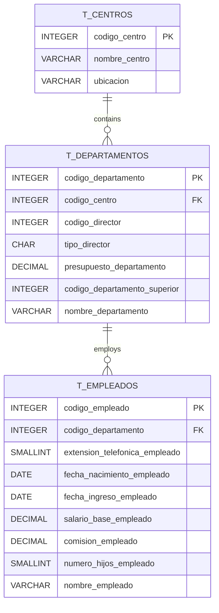
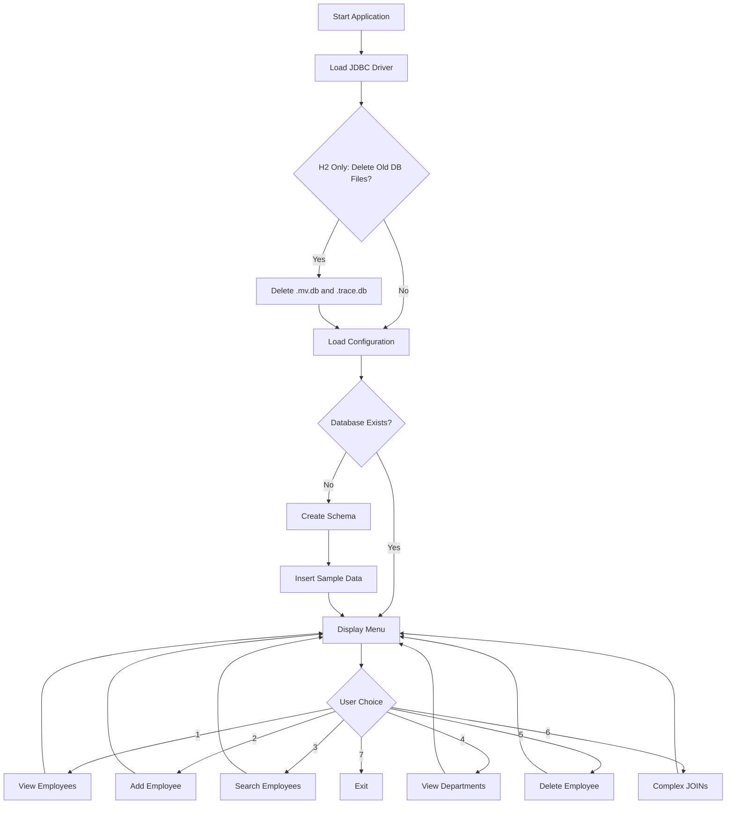

## Overview

The Enterprise Management System provides a complete menu-driven interface for managing an organizational database with three core tables: Centers (Centros), Departments (Departamentos), and Employees (Empleados). Both HSQLDB and H2 implementations offer identical functionality with minor syntax differences.

## Database Schema

The system manages a hierarchical enterprise structure:



## Database Initialization

The system automatically creates the complete schema with sample data on first run:

<Tabs>
  <Tab title="Table Creation">
    ```java DB_EnterpriseHSQLDB.java:62-96
    public static void crearEsquemaCompleto(Connection conn) throws SQLException {
        Statement stmt = conn.createStatement();
        
        // Eliminar tablas si existen
        stmt.execute("DROP TABLE t_empleados IF EXISTS");
        stmt.execute("DROP TABLE t_departamentos IF EXISTS");
        stmt.execute("DROP TABLE t_centros IF EXISTS");
        
        // Crear tablas
        stmt.execute("CREATE TABLE t_centros (" +
                    "codigo_centro INTEGER PRIMARY KEY, " +
                    "nombre_centro VARCHAR(21) NOT NULL, " +
                    "ubicacion VARCHAR(50) NOT NULL)");
        
        stmt.execute("CREATE TABLE t_departamentos (" +
                    "codigo_departamento INTEGER PRIMARY KEY, " +
                    "codigo_centro INTEGER NOT NULL, " +
                    "codigo_director INTEGER NOT NULL, " +
                    "tipo_director CHAR(1) NOT NULL, " +
                    "presupuesto_departamento DECIMAL(10,2) NOT NULL, " +
                    "codigo_departamento_superior INTEGER, " +
                    "nombre_departamento VARCHAR(50) NOT NULL, " +
                    "FOREIGN KEY (codigo_centro) REFERENCES t_centros(codigo_centro))");
        
        stmt.execute("CREATE TABLE t_empleados (" +
                    "codigo_empleado INTEGER PRIMARY KEY, " +
                    "codigo_departamento INTEGER NOT NULL, " +
                    "extension_telefonica_empleado SMALLINT NOT NULL, " +
                    "fecha_nacimiento_empleado DATE NOT NULL, " +
                    "fecha_ingreso_empleado DATE NOT NULL, " +
                    "salario_base_empleado DECIMAL(10,2) NOT NULL, " +
                    "comision_empleado DECIMAL(10,2), " +
                    "numero_hijos_empleado SMALLINT NOT NULL, " +
                    "nombre_empleado VARCHAR(50) NOT NULL, " +
                    "FOREIGN KEY (codigo_departamento) REFERENCES t_departamentos(codigo_departamento))");
    ```
  </Tab>
  
  <Tab title="Sample Data - Centers">
    ```java DB_EnterpriseHSQLDB.java:98-100
    // Insertar datos de CENTROS
    stmt.execute("INSERT INTO t_centros VALUES (10, 'SEDE CENTRAL', 'C/ ALCALA, 820, MADRID')");
    stmt.execute("INSERT INTO t_centros VALUES (20, 'RELACION CON CLIENTES', 'C/ ATOCHA, 405, MADRID')");
    ```
  </Tab>
  
  <Tab title="Sample Data - Departments">
    ```java DB_EnterpriseHSQLDB.java:102-110
    // Insertar datos de DEPARTAMENTOS
    stmt.execute("INSERT INTO t_departamentos VALUES (100, 10, 260, 'P', 120000, NULL, 'DIRECCION GENERAL')");
    stmt.execute("INSERT INTO t_departamentos VALUES (110, 20, 180, 'P', 15000, 100, 'DIRECCION COMERCIAL')");
    stmt.execute("INSERT INTO t_departamentos VALUES (111, 20, 180, 'F', 11000, 110, 'SECTOR INDUSTRIAL')");
    stmt.execute("INSERT INTO t_departamentos VALUES (112, 20, 270, 'P', 9000, 110, 'SECTOR SERVICIOS')");
    stmt.execute("INSERT INTO t_departamentos VALUES (120, 10, 150, 'F', 3000, 100, 'ORGANIZACION')");
    stmt.execute("INSERT INTO t_departamentos VALUES (121, 10, 150, 'P', 2000, 120, 'PERSONAL')");
    stmt.execute("INSERT INTO t_departamentos VALUES (122, 10, 350, 'P', 6000, 120, 'PROCESO DE DATOS')");
    stmt.execute("INSERT INTO t_departamentos VALUES (130, 10, 310, 'P', 2000, 100, 'FINANZAS')");
    ```
  </Tab>
  
  <Tab title="Sample Data - Employees">
    ```java DB_EnterpriseHSQLDB.java:112-118
    // Insertar EMPLEADOS COMPLETOS
    stmt.execute("INSERT INTO t_empleados VALUES (110, 121, 350, '1949-10-11', '1970-02-15', 3100, NULL, 3, 'PONS, CESAR')");
    stmt.execute("INSERT INTO t_empleados VALUES (120, 112, 840, '1955-06-09', '1988-10-01', 3500, 1100, 1, 'LASA, MARIO')");
    stmt.execute("INSERT INTO t_empleados VALUES (130, 112, 810, '1965-09-09', '1989-02-01', 2900, 1100, 2, 'TEROL, LUCIANO')");
    stmt.execute("INSERT INTO t_empleados VALUES (150, 121, 340, '1950-08-10', '1968-01-15', 4400, NULL, 0, 'PEREZ, JULIO')");
    stmt.execute("INSERT INTO t_empleados VALUES (160, 111, 740, '1959-07-09', '1988-11-11', 3100, 1100, 2, 'AGUIRRE, AUREO')");
    stmt.execute("INSERT INTO t_empleados VALUES (180, 110, 508, '1954-10-18', '1976-03-18', 4800, 500, 2, 'PEREZ, MARCOS')");
    ```
  </Tab>
</Tabs>

<Note>
The initialization checks if tables exist using `DatabaseMetaData` to avoid recreating existing databases.
</Note>

## Main Menu System

The application provides an interactive menu with seven operations:

```java DB_EnterpriseHSQLDB.java:124-153
private static void menuPrincipal() {
    while (true) {
        System.out.println("\n=== GESTIÓN EMPRESA ===");
        System.out.println("1. Ver empleados");
        System.out.println("2. Agregar empleado");
        System.out.println("3. Buscar empleados");
        System.out.println("4. Ver departamentos");
        System.out.println("5. Eliminar empleado");
        System.out.println("6. Información completa con JOINs");
        System.out.println("7. Salir");
        System.out.print("Elige: ");

        int opcion = scanner.nextInt();
        scanner.nextLine();

        switch (opcion) {
            case 1: verEmpleados(); break;
            case 2: agregarEmpleado(); break;
            case 3: buscarEmpleados(); break;
            case 4: verDepartamentos(); break;
            case 5: eliminarEmpleado(); break;
            case 6: informacionCompletaJoins(); break;
            case 7: 
                System.out.println("¡Adiós!");
                return;
            default: 
                System.out.println("Opción no válida");
        }
    }
}
```

## CRUD Operations

### View Employees (READ with JOIN)

Displays all employees with their department information:

```java DB_EnterpriseHSQLDB.java:155-174
private static void verEmpleados() {
    String sql = "SELECT e.*, d.nombre_departamento FROM t_empleados e " +
                 "JOIN t_departamentos d ON e.codigo_departamento = d.codigo_departamento";

    try (Connection conn = DriverManager.getConnection(URL, USER, PASSWORD);
         PreparedStatement ps = conn.prepareStatement(sql);
         ResultSet rs = ps.executeQuery()) {

        System.out.println("\n--- EMPLEADOS ---");
        while (rs.next()) {
            System.out.println("ID: " + rs.getInt("codigo_empleado") + 
                             " | Nombre: " + rs.getString("nombre_empleado") +
                             " | Depto: " + rs.getString("nombre_departamento") +
                             " | Salario: " + rs.getDouble("salario_base_empleado") +
                             " | Ingreso: " + rs.getDate("fecha_ingreso_empleado"));
        }
    } catch (SQLException e) {
        System.out.println("Error: " + e.getMessage());
    }
}
```

### Add Employee (CREATE)

Interactive employee creation with parameterized queries:

```java DB_EnterpriseHSQLDB.java:176-212
private static void agregarEmpleado() {
    try {
        System.out.println("\n--- NUEVO EMPLEADO ---");
        System.out.print("Código: ");
        int codigo = scanner.nextInt();
        System.out.print("Departamento: ");
        int depto = scanner.nextInt();
        scanner.nextLine();
        System.out.print("Nombre: ");
        String nombre = scanner.nextLine();
        System.out.print("Salario: ");
        double salario = scanner.nextDouble();
        scanner.nextLine(); // Limpiar buffer
        System.out.print("Fecha ingreso (YYYY-MM-DD): ");
        String fecha = scanner.nextLine();

        String sql = "INSERT INTO t_empleados (codigo_empleado, codigo_departamento, " +
                    "extension_telefonica_empleado, fecha_nacimiento_empleado, " +
                    "fecha_ingreso_empleado, salario_base_empleado, comision_empleado, " +
                    "numero_hijos_empleado, nombre_empleado) VALUES (?, ?, 100, '1990-01-01', ?, ?, 0, 0, ?)";

        try (Connection conn = DriverManager.getConnection(URL, USER, PASSWORD);
             PreparedStatement pstmt = conn.prepareStatement(sql)) {

            pstmt.setInt(1, codigo);
            pstmt.setInt(2, depto);
            pstmt.setString(3, fecha);
            pstmt.setDouble(4, salario);
            pstmt.setString(5, nombre);

            pstmt.executeUpdate();
            System.out.println("Empleado agregado!");
        }
    } catch (SQLException e) {
        System.out.println("Error: " + e.getMessage());
    }
}
```

<Accordion title="Why PreparedStatement?">
PreparedStatements prevent SQL injection attacks by separating SQL structure from data. Parameters are properly escaped and validated by the database driver.
</Accordion>

### Search Employees (READ with LIKE)

Pattern-matching search using wildcards:

```java DB_EnterpriseHSQLDB.java:214-236
private static void buscarEmpleados() {
    System.out.print("\nBuscar por nombre: ");
    String nombre = scanner.nextLine();

    String sql = "SELECT * FROM t_empleados WHERE nombre_empleado LIKE ?";

    try (Connection conn = DriverManager.getConnection(URL, USER, PASSWORD);
         PreparedStatement pstmt = conn.prepareStatement(sql)) {

        pstmt.setString(1, "%" + nombre + "%");
        ResultSet rs = pstmt.executeQuery();

        System.out.println("\n--- RESULTADOS ---");
        while (rs.next()) {
            System.out.println("ID: " + rs.getInt("codigo_empleado") + 
                             " | Nombre: " + rs.getString("nombre_empleado") +
                             " | Salario: " + rs.getDouble("salario_base_empleado") +
                             " | Ingreso: " + rs.getDate("fecha_ingreso_empleado"));
        }
    } catch (SQLException e) {
        System.out.println("Error: " + e.getMessage());
    }
}
```

### Delete Employee (DELETE)

Delete operation with confirmation feedback:

```java DB_EnterpriseHSQLDB.java:293-315
private static void eliminarEmpleado() {
    try {
        System.out.println("Ingresa el código del empleado que quieras eliminar: ");
        int codigo = scanner.nextInt();
        
        String sql = "DELETE FROM t_empleados WHERE codigo_empleado = ?";
        
        try(Connection conn = DriverManager.getConnection(URL, USER, PASSWORD);
            PreparedStatement ps = conn.prepareStatement(sql)) {
            
            ps.setInt(1, codigo);
            int filasAfectadas = ps.executeUpdate();
            
            if (filasAfectadas > 0) {
                System.out.println("Empleado eliminado correctamente");
            } else {
                System.out.println("No se encontró el empleado con ese código");
            }
        }
    } catch (Exception e) {
        System.out.println("Error al eliminar: " + e.getMessage());
    }
}
```

## Advanced JOIN Operations

The system demonstrates complex multi-table JOINs to combine data from all three tables:

```java DB_EnterpriseHSQLDB.java:256-291
private static void informacionCompletaJoins() {
    String sql = "SELECT " +
                "e.codigo_empleado, " +
                "e.nombre_empleado, " +
                "e.salario_base_empleado, " +
                "e.fecha_ingreso_empleado, " +
                "d.nombre_departamento, " +
                "d.presupuesto_departamento, " +
                "c.nombre_centro, " +
                "c.ubicacion " +
                "FROM t_empleados e " +
                "JOIN t_departamentos d ON e.codigo_departamento = d.codigo_departamento " +
                "JOIN t_centros c ON d.codigo_centro = c.codigo_centro " +
                "ORDER BY e.codigo_empleado";

    try (Connection conn = DriverManager.getConnection(URL, USER, PASSWORD);
         PreparedStatement ps = conn.prepareStatement(sql);
         ResultSet rs = ps.executeQuery()) {

        System.out.println("\n--- INFORMACIÓN COMPLETA EMPLEADOS (CON JOINS) ---");
        System.out.println("==========================================================================");
        while (rs.next()) {
            System.out.println("ID Empleado: " + rs.getInt("codigo_empleado"));
            System.out.println("Nombre: " + rs.getString("nombre_empleado"));
            System.out.println("Salario: " + rs.getDouble("salario_base_empleado"));
            System.out.println("Fecha Ingreso: " + rs.getDate("fecha_ingreso_empleado"));
            System.out.println("Departamento: " + rs.getString("nombre_departamento"));
            System.out.println("Presupuesto Depto: " + rs.getDouble("presupuesto_departamento"));
            System.out.println("Centro: " + rs.getString("nombre_centro"));
            System.out.println("Ubicación: " + rs.getString("ubicacion"));
            System.out.println("---------------------------------------------------------------------------");
        }
    } catch (SQLException e) {
        System.out.println("Error: " + e.getMessage());
    }
}
```

<Note>
This query performs two INNER JOINs to combine employee, department, and center data in a single result set.
</Note>

## Key Design Patterns

<Card title="Try-with-Resources" icon="code">
  All database operations use try-with-resources to ensure automatic resource cleanup, preventing connection leaks.
</Card>

<Card title="PreparedStatements" icon="shield-check">
  User input is always handled through PreparedStatements with parameter binding to prevent SQL injection.
</Card>

<Card title="Error Handling" icon="circle-exclamation">
  Each operation includes SQLException handling with user-friendly error messages while preserving stack traces for debugging.
</Card>

<Card title="Menu-Driven Interface" icon="list">
  The infinite loop menu pattern with switch-case provides intuitive navigation and operation selection.
</Card>

## HSQLDB vs H2 Differences

Both implementations are nearly identical, with minor differences:

| Aspect | HSQLDB | H2 |
|--------|--------|----|
| **DROP IF EXISTS Syntax** | `DROP TABLE t_empleados IF EXISTS` | Same |
| **File Cleanup** | No automatic cleanup | Explicit file deletion in `eliminarArchivosBD()` |
| **Menu Title** | "=== GESTIÓN EMPRESA ===" | "=== GESTIÓN EMPRESA (H2) ===" |
| **Driver Loading** | `org.hsqldb.jdbc.JDBCDriver` | `org.h2.Driver` |

## Complete Application Flow



## Running the Application

<CodeGroup>
```bash HSQLDB
javac -cp ".:hsqldb.jar" DB_EnterpriseHSQLDB.java
java -cp ".:hsqldb.jar" DB_EnterpriseHSQLDB
```

```bash H2
javac -cp ".:h2.jar" DB_EnterpriseH2.java
java -cp ".:h2.jar" DB_EnterpriseH2
```
</CodeGroup>

## Next Steps

Explore related topics:

- [Database Configuration](/components/database-configuration) - Configuration patterns and best practices
- [Counter Implementations](/components/counter-implementations) - Concurrency and atomic operations